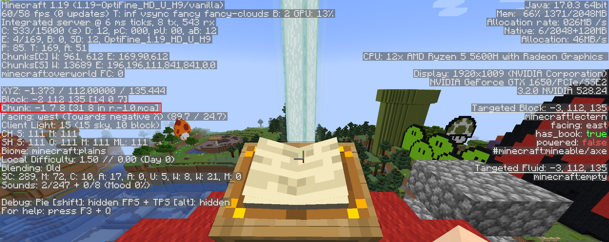

# Writers' encryption

## Description
```
Bowser has implemented a new encryption system to communicate securely with his henchmen.
You have managed to intercept an exchange using this new system.
Decode the message that has been encrypted.
```

## Flag
**`ECTF{mushrooms_are_the_key}`**

## Resolution
- Understand the interest of the Minecraft map => launch the game and discover the books
- Discover the type of encryption => Google search: encryption + book => book cipher
- Retrieve the text contained in the books => Minecraft map editor (NBTExplorer) => search in the regions where the books are located (F3 in the game)

    - 1st book: `region/r.0.0.mca/Chunk [0,8]/block_entities/7 entries/Book/tag/pages`
    - 2nd book: `region/r.-1.0.mca/Chunk [31,8]/block_entities/7 entries/Book/tag/pages`
- Decrypt the message => decryption tool book cipher: https://www.boxentriq.com/code-breaking/book-cipher => pattern : `line:word:char` (take into account the underscore in the flag)