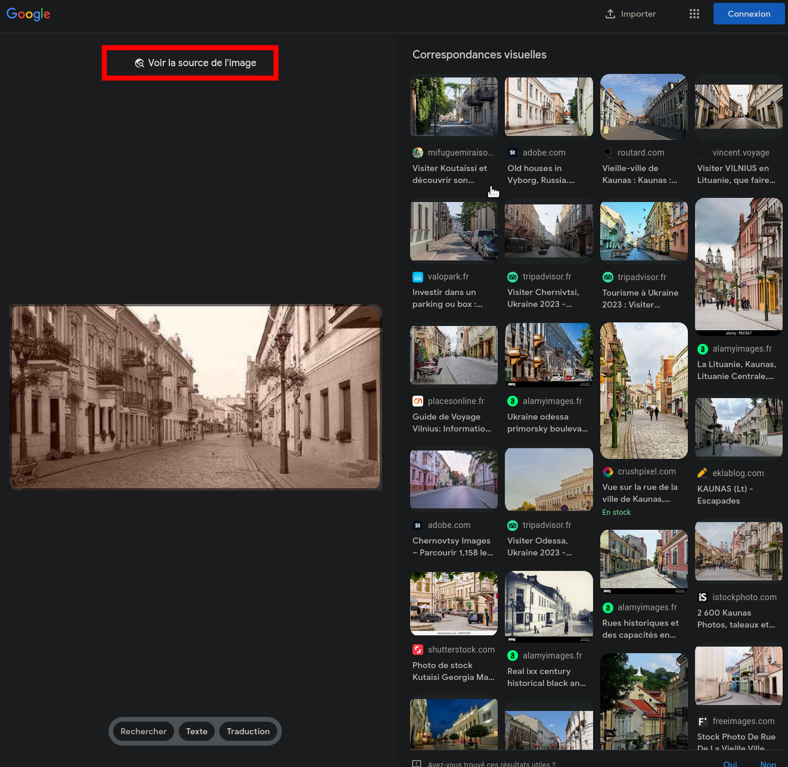
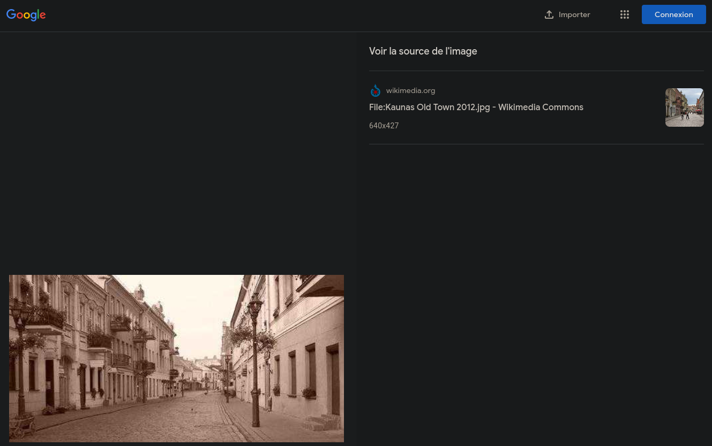
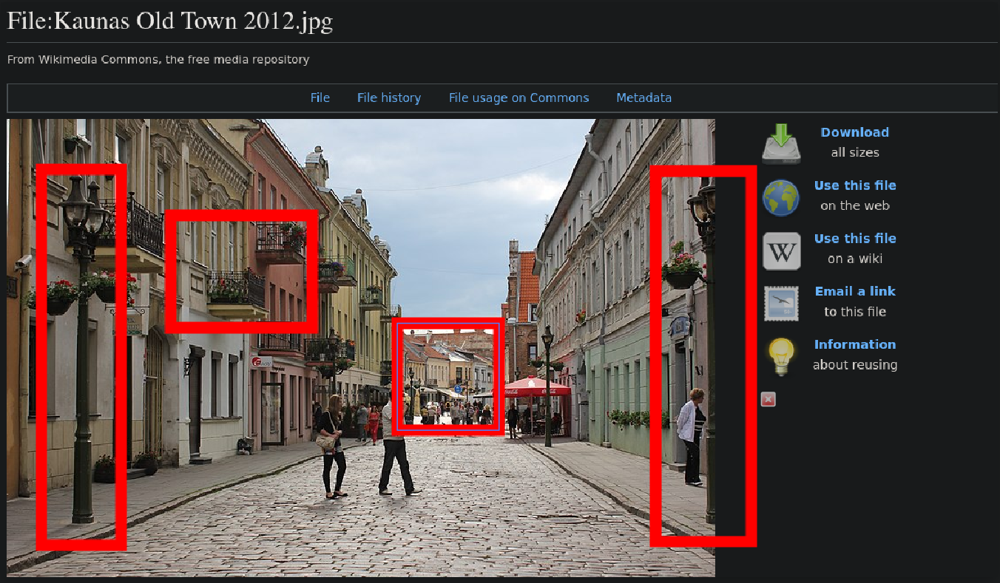
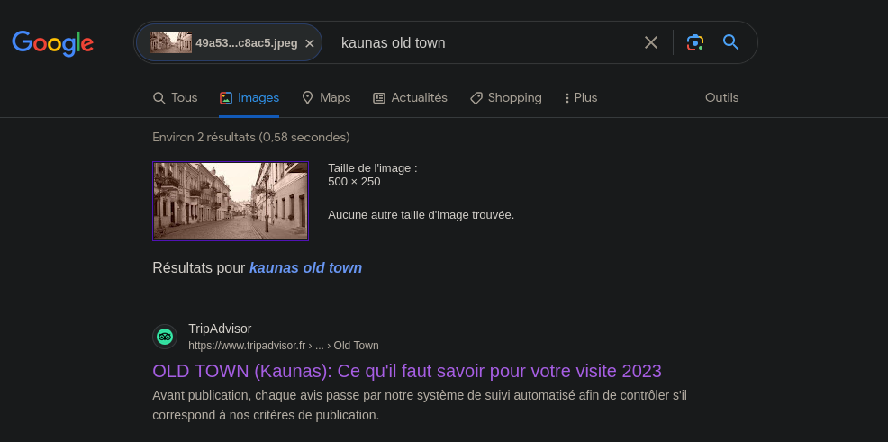
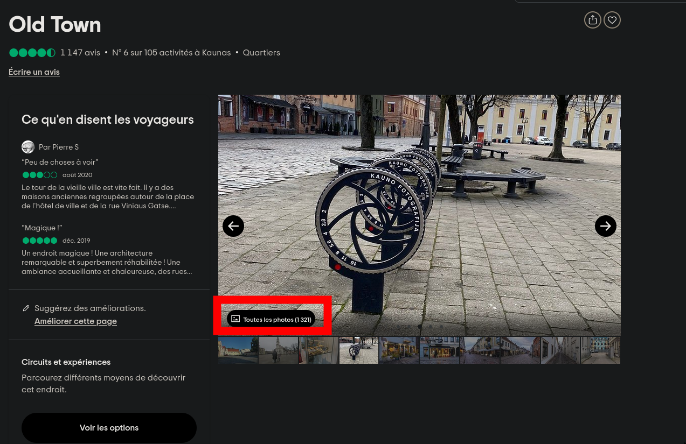
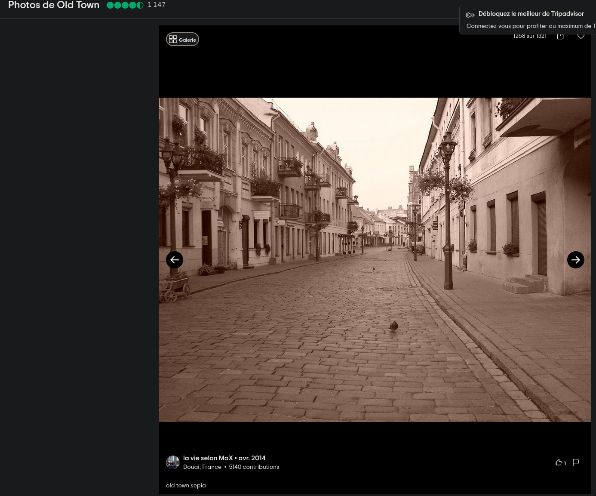
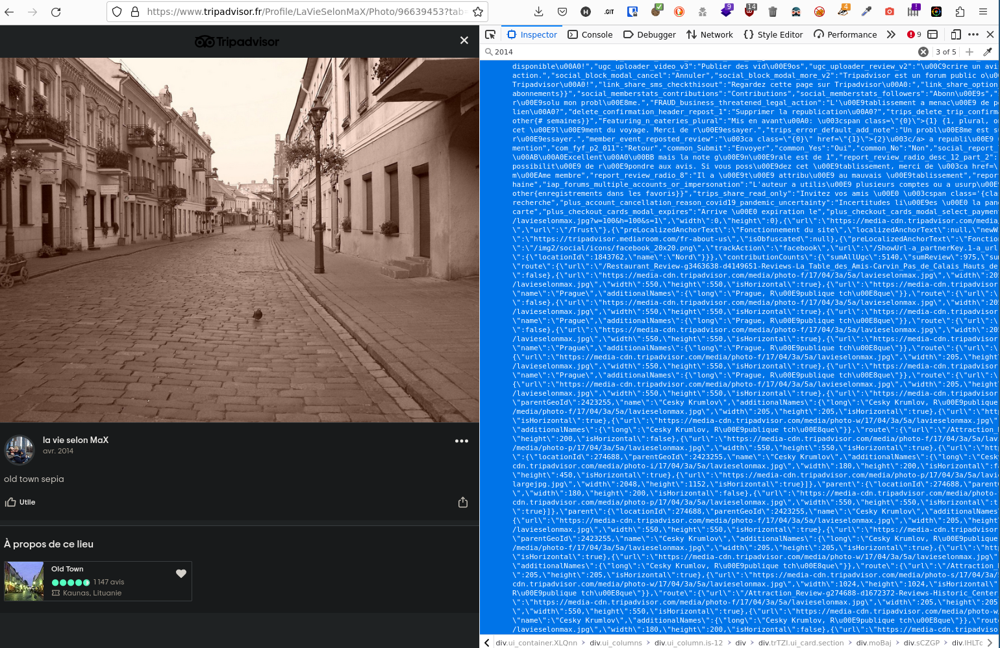
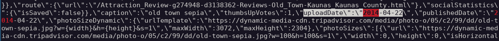

# Wrong kingdom

```
During his odyssey, Mario used the magic hat Cappy to travel between kingdoms. After visiting New Donk City, he arrived in an unknown realm and took this picture before posting it on the so-called internet. Find the name of the city of this photo and the date it's date of publication to help Mario to find his way back!
```

## Flag

**`ECTF{Kaunas;2014-04-22}`**

## Resolution

We start with a simple google image reverse search :



We found a wikimedia page with the same place and can verify it with different points of comparison:

We can now go further by adding the name of the city in a reverse image search:

We have one result matching and can now start comparing the different images found on tripadvisor:


We found the right one (https://www.tripadvisor.fr/Profile/LaVieSelonMaX/Photo/96639453?tab=photos) and can now go to the profile of this person for further investigation.
After some scrolling we can read the source code of the web page and see that tripadvisor is only showing the month and the year but we can actually find the exact date :

